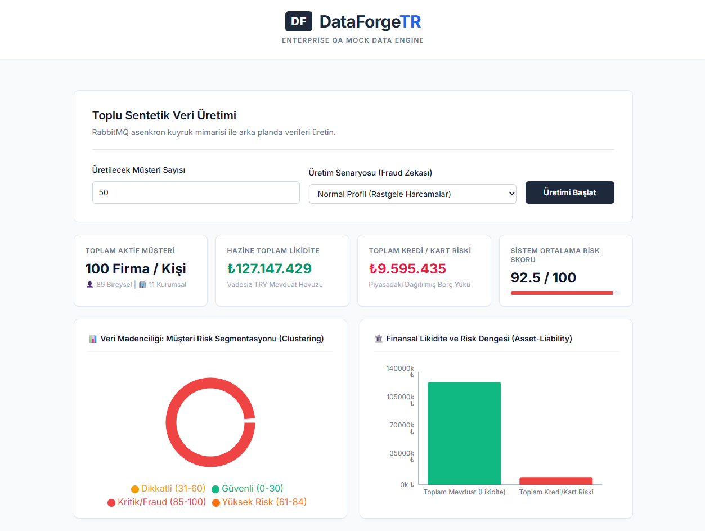
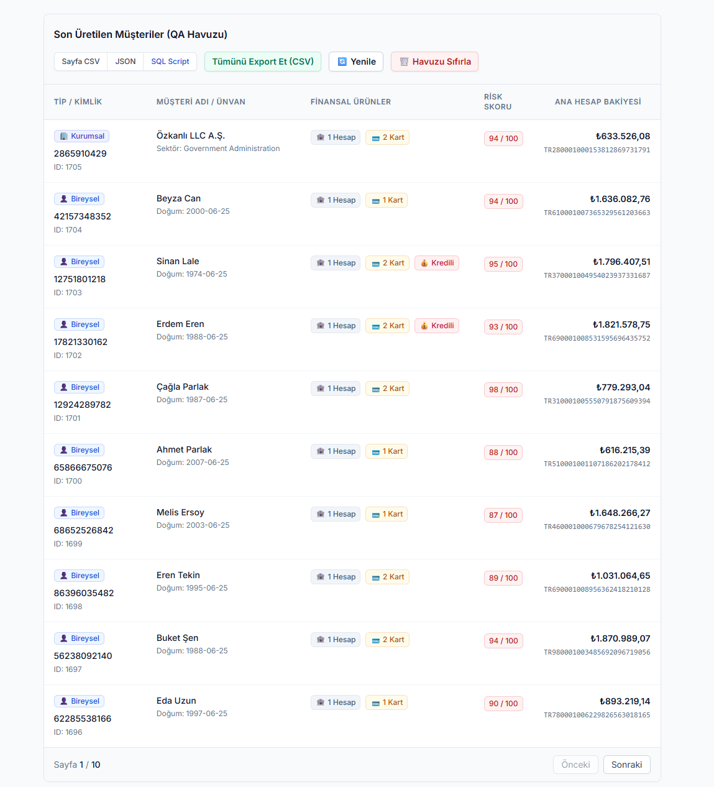
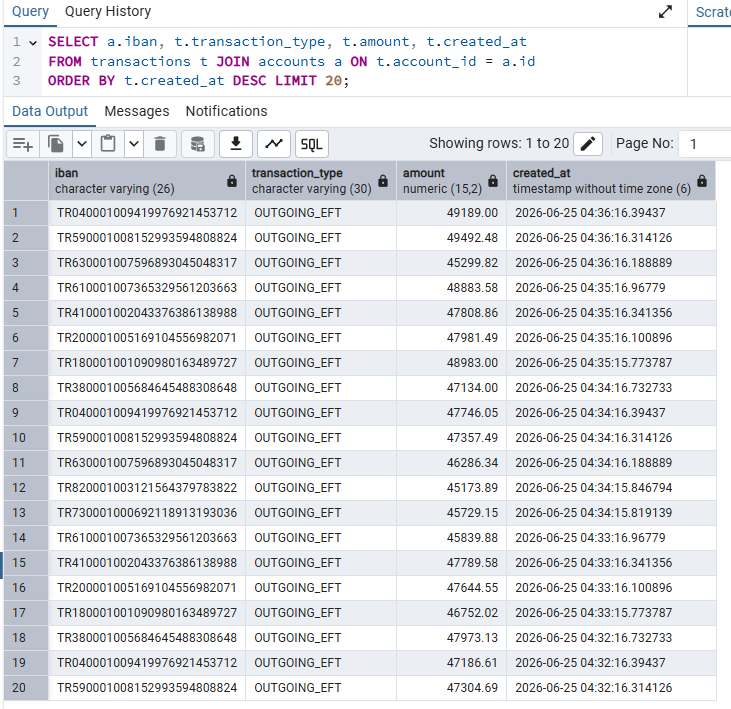
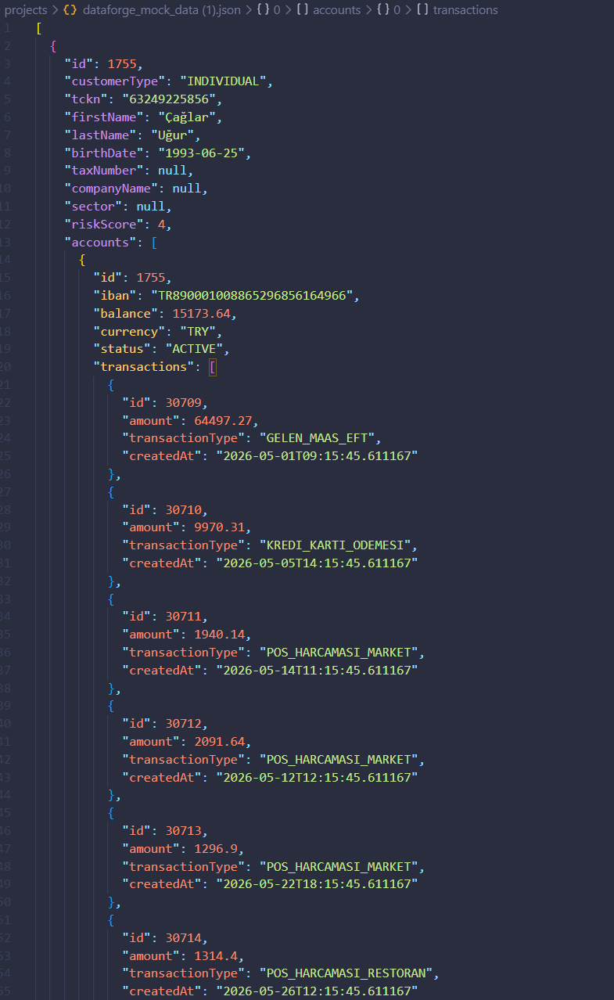
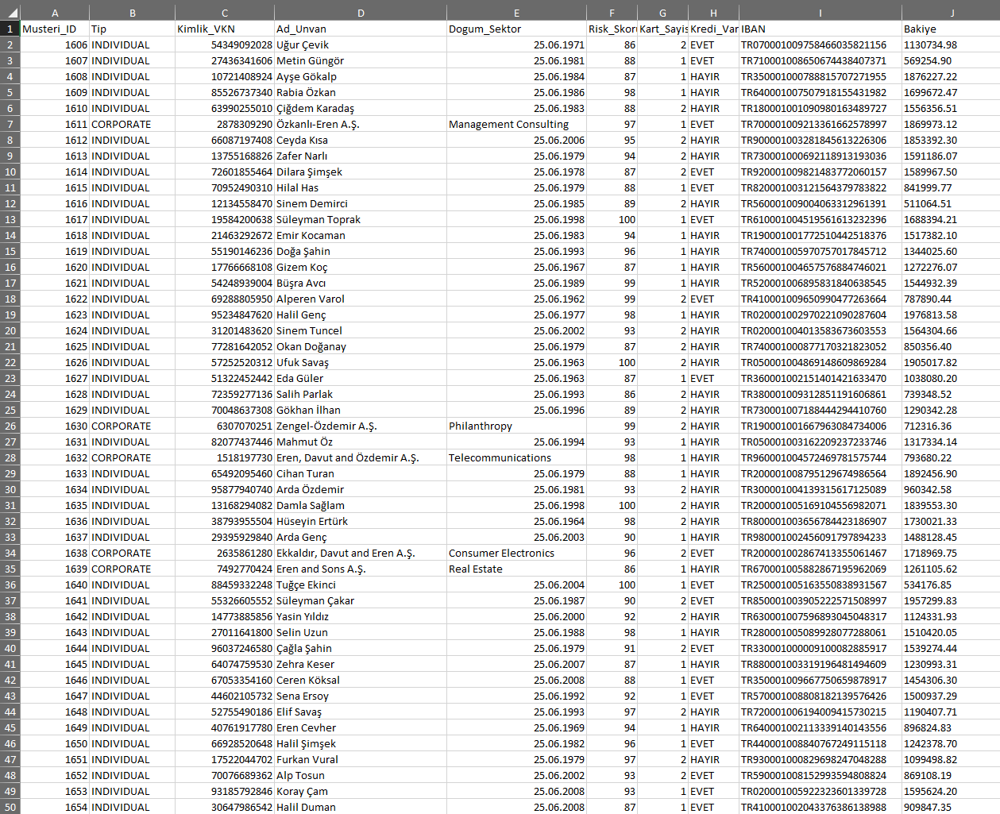
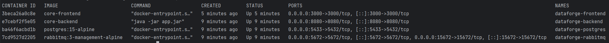

<div align="center">
  <a href="#türkçe">🇹🇷 Türkçe</a> •
  <a href="#english">🇬🇧 English</a>
</div>

---

# <a id="türkçe"></a>DataForge-TR: Kurumsal Asenkron Sentetik Veri Motoru


DataForge-TR, bankacılık ve finans gibi kompleks sistemlerin test (QA) ortamları için gerçeğinden ayırt edilemeyen, ilişkisel bütünlüğe sahip ve yüksek hacimli sentetik veri üreten bir Mock Data Engine (Test Verisi Motoru) projesidir.

Sıradan veri üretim araçlarının aksine; finansal iş zekasını (Business Logic), dolandırıcılık (Fraud) senaryolarını ve zaman serisine dayalı (time-series) işlem geçmişlerini veritabanı seviyesinde simüle eder.

---

## Veri Gizliliği ve KVKK/GDPR Uyumluluğu (Yasal Uyarı)
> **Önemli Not:** Sistemde, veritabanında ve dokümantasyondaki ekran görüntülerinde yer alan tüm isimler, TCKN/VKN'ler, IBAN'lar, risk skorları ve finansal tutarlar algoritmik olarak üretilmiş **%100 sentetik (sahte) verilerdir**. Gerçek kişi, kurum veya bankalarla hiçbir ilgisi bulunmamaktadır.
>
> Bu mimari; veri gizliliği yasalarını (KVKK/GDPR) ihlal etmeden ve gerçek müşteri verilerini (Production Data) riske atmadan, yazılım test ortamlarına (QA) güvenli veri sağlamak amacıyla mühendislik standartlarında tasarlanmıştır.

---

## Mühendislik Çözümleri ve Mimari

### Asenkron Mesaj Kuyruğu (RabbitMQ) ile Ölçeklenebilirlik
Yüksek hacimli veri üretim taleplerinin ana sunucuyu kilitlemesini (HTTP Timeout) engellemek amacıyla asenkron bir mimari tasarlanmıştır. İstekler RabbitMQ'ya iletilir ve backend servisleri tarafından arka planda yük dengelemesi (Load Leveling) yapılarak işlenir.

### Finansal Zaman Serisi (Time-Series) Simülasyonu
Veritabanı kayıtları statik bakiyelerden ibaret değildir. Sistem, seçilen müşteri senaryosuna (Normal, Yüksek Risk, AML) uygun olarak geriye dönük 3 aylık tutarlı bir finansal tarihçe (Maaş yatırımı, kredi kartı ödemeleri, periyodik harcamalar) oluşturur.

### Memory-Safe Streaming Export
Yüz binlerce satırlık test verisinin dışa aktarımı sırasında yaşanabilecek bellek taşmalarını (OutOfMemory) önlemek için `StreamingResponseBody` ve Cursor/Pagination algoritmaları kullanılmıştır. Veriler belleğe yüklenmeden, doğrudan PostgreSQL üzerinden istemciye akıtılır (streaming).

---

## Sistem Görünümleri ve Çıktılar

### 1. Hazine Yönetimi ve Risk Segmentasyonu Dashboard'u

Veritabanı seviyesinde çalışan veri kümeleme (Clustering) algoritmaları ile anlık likidite (varlık) ve borç (yükümlülük) oranlarının analiz edilmesi.



---

### 2. İnteraktif Kullanıcı Grid'i ve Risk Skorlaması

Müşteri tipi, finansal ürün portföyü ve sistem tarafından atanan risk skorlarının izlenebildiği, Client-Side State yönetimine sahip ana veri tablosu.



---

### 3. Kara Para Aklama (AML) Senaryosu ve Veritabanı Yansıması

Smurfing benzeri şüpheli işlem desenlerinin (gece saatlerinde yapılan ardışık ve yüksek tutarlı transferler) PostgreSQL üzerindeki görünümü.



---

### 4. Hiyerarşik Veri Yapısı ve JSON Export

Zaman serisi mantığıyla üretilmiş 3 aylık finansal simülasyon ağacının, otomasyon testlerine beslenmeye hazır JSON formatı.



---

### 5. İş Birimleri İçin Yapılandırılmış Excel/CSV Çıktısı

QA mühendisleri ve iş analistleri (BA) için Memory-Safe akış ile oluşturulmuş, teste hazır yapılandırılmış veri seti.



---

## Kurulum ve Çalıştırma (Docker)

Sistem mimarisi (PostgreSQL, RabbitMQ, Spring Boot, Next.js) tamamen konteynerize edilmiştir. Yerel ortamda test etmek için ek bir bağımlılık kurulmasına gerek yoktur.



1. Projeyi bilgisayarınıza klonlayın:
   ```bash
   git clone [https://github.com/maliisk/DataForge-TR.git](https://github.com/maliisk/DataForge-TR.git)
   cd DataForge-TR
   ```

2. Docker Compose ile tüm servisleri başlatın:
   ```bash
   docker-compose up --build -d
   ```

3. Web arayüzüne erişim sağlayın:
   **http://localhost:3000**

---
*Muhammed Ali Işık | [muhammedaliisik.com](https://muhammedaliisik.com/)*

<br>
<br>

---

# <a id="english"></a>DataForge-TR: Enterprise Asynchronous Synthetic Data Engine


DataForge-TR is a Mock Data Engine project designed to generate highly voluminous, relationally intact, and indistinguishable-from-real synthetic data for testing (QA) environments of complex systems like banking and finance.

Unlike ordinary data generation tools, it simulates financial business logic, fraud scenarios, and time-series-based transaction histories directly at the database level.

---

## Data Privacy and KVKK/GDPR Compliance (Disclaimer)
> **Important Note:** All names, National ID/Tax Numbers (TCKN/VKN), IBANs, risk scores, and financial amounts featured in the system, database, and documentation screenshots are **100% synthetic (mock) data** generated algorithmically. They have no connection to real individuals, institutions, or banks.
>
> This architecture is engineered to provide safe data for software testing (QA) environments without violating data privacy laws (KVKK/GDPR) and without risking real customer data (Production Data).

---

## Engineering Solutions and Architecture

### Scalability with Asynchronous Message Queue (RabbitMQ)
To prevent high-volume data generation requests from bottlenecking the main server (HTTP Timeout), an asynchronous architecture is implemented. Requests are dispatched to RabbitMQ and processed in the background by backend listeners using Load Leveling techniques.

### Financial Time-Series Simulation
Database records are not mere static balances. Based on the selected customer scenario (Normal, High Risk, AML), the system generates a consistent 3-month retrospective financial history (Salary deposits, credit card payments, periodic POS expenditures).

### Memory-Safe Streaming Export
To prevent memory overflows (OutOfMemory) during the extraction of hundreds of thousands of test data rows, `StreamingResponseBody` and Cursor/Pagination algorithms are utilized. Data is streamed directly to the client from PostgreSQL without loading the entire dataset into memory.

---

## System Views and Outputs

### 1. Treasury Management and Risk Segmentation Dashboard

Analysis of instant liquidity (assets) and debt (liabilities) ratios using data clustering algorithms running at the database level.


---

### 2. Interactive User Grid and Risk Scoring

A main data table featuring Client-Side State management, where customer types, financial product portfolios, and system-assigned risk scores can be monitored.


---

### 3. Anti-Money Laundering (AML) Scenario and Database Reflection

PostgreSQL view of Smurfing-like suspicious transaction patterns (consecutive, high-amount transfers executed during midnight hours).


---

### 4. Hierarchical Data Structure and JSON Export

A 3-month financial simulation tree generated with time-series logic, formatted as JSON and ready to be fed into automation tests.


---

### 5. Structured Excel/CSV Output for Business Units

A structured dataset generated via Memory-Safe streaming, ready for testing by QA engineers and Business Analysts (BA).


---

## Installation and Execution (Docker)

The system architecture (PostgreSQL, RabbitMQ, Spring Boot, Next.js) is fully containerized. No additional dependencies are required to test it in a local environment.


1. Clone the repository to your computer:
   ```bash
   git clone [https://github.com/maliisk/DataForge-TR.git](https://github.com/maliisk/DataForge-TR.git)
   cd DataForge-TR
   ```

2. Start all services using Docker Compose:
   ```bash
   docker-compose up --build -d
   ```

3. Access the web interface:
   **http://localhost:3000**

---
*Muhammed Ali Işık | [muhammedaliisik.com](https://muhammedaliisik.com/)*